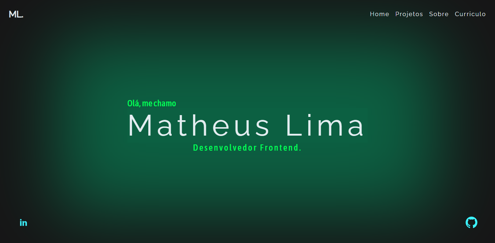

<h1 align="center">
   🔗 MyPortfolio
</h1>

 <a href="#descrição">🧾 Descrição</a> • 
 <a href="#tecnologias">🚀 Tecnologias</a> • 
 <a href="#license">📝 License</a> • 
 <a href="#autor">Autor</a>

<h2>🧾Descrição</h2>

<blockquote >
  Esse é meu portfolio para em apresentar e mostrar os meus conhecimentos de uma forma diferente.
</blockquote>

Acesse o projeto clicando <a href="https://blog-react-the-matheuslima.vercel.app/" target="_blank"> aqui </a> 

<h2>🚀Tecnologias</h2/>

As seguintes ferramentas foram usadas na construção do projeto:

- [Firebase](https://firebase.google.com/)
- [ReactJs](https://pt-br.reactjs.org/)
- [Scss](https://sass-lang.com/)
- [Vite](https://vitejs.dev/guide/#scaffolding-your-first-vite-project)
- [React-Icons](https://react-icons.github.io/react-icons/)

<h2>📝License</h2>

Esse projeto está sob a licença MIT. Veja o arquivo <a href="https://github.com/the-matheuslima/MyPortfolio/blob/main/LICENSE">LICENSE</a> para mais detalhes.

### Autor

---

<a href="https://github.com/the-matheuslima/">
 
  
 <b>Matheus Lima</b></a>

Feito com ❤️ por Matheus Lima 👋🏽 Entre em contato!

